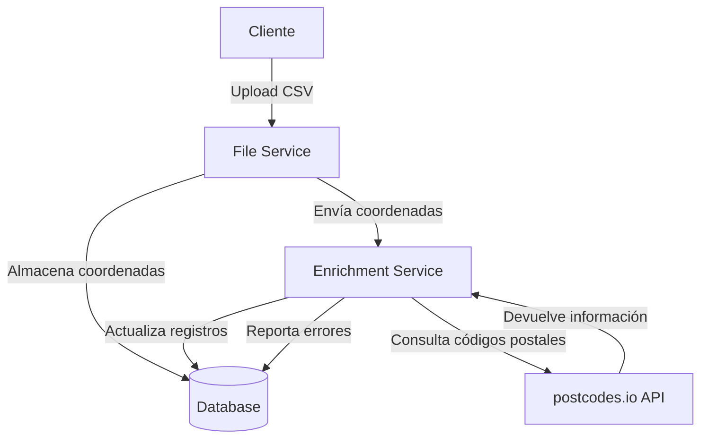
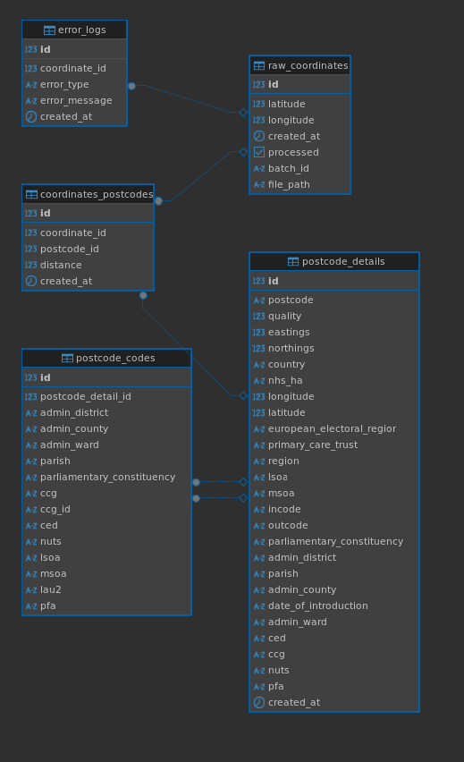

# prueba-de

# Proyecto de Códigos Postales

La solución para procesar y enriqueser los datos fue desplegada utilizando **Docker Compose**, haciendo uso del orquestador Airflow, en el cual se desarrollo dos flujos principales:

1. **Ingestión de Datos**
   - Se recibe un archivo CSV con coordenadas geográficas.
   - Se realiza una validación de datos y limpieza de duplicados.
   - Los datos procesados se almacenan en una base de datos PostgreSQL en la tabla `raw_coordinates`.

2. **Enriquecimiento de Datos**
   - Se extraen las coordenadas no procesadas o enriquesidas por la API.
   - Se realizan llamadas a la API `api.postcodes.io` para obtener los códigos postales.
   - Los resultados exitosos se almacenan en `postcode_details`,`coordinates_postcodes` y `postcode_codes`.
   - Los errores se registran en `error_logs`.

## Arquitectura


El flujo de datos en el sistema es el siguiente:

1. **Airflow DAG de Ingestión** (`01_postcodes_ingestion`):
   - Detecta y carga nuevos archivos CSV.
   - Realiza validaciones y limpieza de datos.
   - Inserta los datos en `raw_coordinates`.
   - Dispara automáticamente el DAG de enriquecimiento una vez que los datos han sido cargados.

2. **Airflow DAG de Enriquecimiento** (`02_postcode_enrichment`):
   - Obtiene las coordenadas pendientes de procesamiento.
   - Realiza llamadas a la API de postcodes en paralelo para optimizar tiempos.
   - Almacena los códigos postales obtenidos y marca las coordenadas como procesadas.

3. **Exploración y Análisis con Jupyter Notebook**:
   - Se analizan los códigos postales más comunes.
   - Se calculan estadísticas sobre la calidad de los datos.
   - Se generan archivos CSV con los resultados.

## Cómo Ejecutar el Proyecto

### **Configuración del Entorno Airflow**
 
1. Habilitar permisos al archivo `creation-tables.sql`:
```bash
chmod +x init-scripts/creation-tables.sql
```

2. Asegurar las variables de entorno para la conexión a PostgreSQL tanto para el servicio de Airflow, como tambien donde alojaremos los datos. (**.env**)

3. Desplegar con Docker Compose para iniciar todos los servicios, ejecuta:

```bash
docker-compose up -d
```
Esto iniciará **Airflow, PostgreSQL y los servicios necesarios**.

Para ver los logs de los contenedores:
```bash
docker-compose logs -f
```

Despues verifica que el contenedor de airflow-webserver se haya construido correctamente. Y luego ve al navegador de tu preferencia para ir al UI de [Airflow](http://localhost:8080).

### **Ejecución de los DAGs**

Inicialmente debes encontrar 3 Dags activaran y ejecutaran progresivamente avance la automatizacion. (Por defecto los dags se habilitaran una vez los servicios esten en linea)
- `00_setup_connections` tiene el objetivo de configurar las conexiones que usaremos para este ejercicio.

- El DAG de **ingestión** (`01_postcodes_ingestion`), funciona como un sensor que apunta a la carpeta `data` y ademas de dispararse unicamente cuando un archivo csv tenga el siguiente patron `postcodes_geo*.csv`. Una vez el archivo con esta caracteristica es creado, el dag ejecutara las tareas programadas de validacion, limpieza de duplicados y escritura en la tabla `raw_coordinates`. Si todas las tareas han sido ejecutadas exitosamente se dispara un trigger que ejecutara el dag de enriquecimiento.

- El DAG de **enriquecimiento** (`02_postcode_enrichment`) se ejecutará aautomáticamente una vez finalice el primer dag. Este proceso se encarga de obtener las coordenadas no procesadas de la tabla raw_coordinates en lotes de 2000 registros. Para cada lote, se realizan llamadas en paralelo a la API de `postcodes.io` utilizando un máximo de 10 hilos simultáneos y respetando un límite de 2000 peticiones por minuto. Los códigos postales obtenidos se almacenan en la tabla `postcode_details`, y se crea la relación con las coordenadas en `coordinates_postcodes`. Si durante el proceso ocurre algún error, este se registra en la tabla `error_logs` para su posterior análisis. El proceso se repite automáticamente mientras existan coordenadas sin procesar.

#### Verificación de datos usando el backup

Si se desea se ha compartido en Google Drive un archivo comprimido donde encontrara 2 carpetas con los resultados obtenidos. Para hacer la correcta recuperación de estos datos puede seguir los siguientes pasos:

1. **Descargar Backup**
   - El archivo ZIP con los datos completos está disponible en [Google Drive](https://drive.google.com/file/d/1Ad6kOV6x0DEA7mhwYeKMa0ppQg_BeFsB/view?usp=sharing).
   - Descárgalo y descomprímelo en la raíz de tu proyecto.

2. **Mueve el archivo `restore.sh` a la carpeta `db-init/`**
   ```bash
   mv ./database-backups/restore.sh ./db-init/restore.sh
   ```

3. **Preparación del Docker Compose**
   - Abre el archivo `docker-compose.yml`
   - Descomenta la línea de volumen para los backups:
   
   ```yaml
   # - ./database-backups:/backups
   ```

4. **Permisos del Script de Restauración**
   ```bash
   chmod +x db-init/restore.sh
   ```
5. **Continuar con los pasos de configuración del entorno Airflow**

### **Diseño de Base de Datos**



La base de datos se diseñó siguiendo un enfoque que separa los datos crudos de entrada de los datos enriquecidos usando la API, permitiendo una gestión optima del procesamiento y manteniendo trazabilidad sobre los errores. La tabla `raw_coordinates` actúa como entrada, almacenando las coordenadas originales junto con algunos metadatos como la ruta donde esta guardado archivo. Esta separación permite mantener los datos originales intactos mientras se procesan y enriquecen. Para el almacenamiento de los códigos postales, se crearon 3 tablas para evitar la duplicación de información mediante, la tabla `postcode_details` almacena la información única de cada código postal, la tabla `coordinates_postcodes` maneja la relación muchos a muchos entre coordenadas crudas y códigos postales, donde se incluye la distancia como un atributo de esta relación. Este diseño normalizado no solo optimiza el almacenamiento sino que también facilita las actualizaciones y el mantenimiento de la consistencia de los datos.

Los índices fueron seleccionados para optimizar los patrones de consulta más frecuentes y las operaciones críticas del sistema. En raw_coordinates, se implementó un índice compuesto sobre (latitude, longitude) para acelerar las búsquedas y la detección de duplicados. El índice sobre processed optimiza la identificación de registros pendientes de procesamiento, mientras que el índice sobre batch_id mejora el rendimiento de las operaciones por lotes. En `postcode_details`, el índice único sobre postcode garantiza la unicidad y acelera las búsquedas por código postal, complementado por índices adicionales sobre region y country para mejorar el rendimiento de las agregaciones geográficas. La tabla `coordinates_postcodes` se crearon índices sobre sus llaves foráneas para optimizar los joins, y un índice sobre `distance` para mejorar el rendimiento de las consultas que involucran análisis de proximidad.

### **Reportes**

El analisis exploratorio de los datos se puede encontrar en el siguiente [notebook](notebooks/eda_postcodes.ipynb), las dependencias necesarias para su ejecutarlo lo encuentras en este [requirement](notebooks/requirements.txt)

Los datos enriquecidos y las estadísticas se generarán en archivos CSV:
- [`postcode_enriched_data.csv`](data/postcode_enriched_data.csv)
- [`postcode_quality_statistics.csv`](data/postcode_quality_statistics.csv)
- [`top_postcodes.csv`](data/top_postcodes.csv)
 
## **Mejoras**

La arquitectura actual enriquece alrededor de 85mil registros cada hora, lo que significa que para el archivo de 2 millones de registros, el enriquecimiento completo toma alrededor de 24 horas. Si bien el sistema cumple con su objetivo, hay varias optimizaciones que hubieran podido mejorar su eficiencia.

- Se pudo haber implementado un sistema de caché para coordenadas cercanas evitando llamadas API redundantes, el problema es definir una distancia del codigo postal a la coordenada.

- Tambien tuve warnings con el connection pooling de la base de datos que actualmente está limitado a 10 conexiones simultáneas, y debi haberlo optimizado para agilizar el proceso de enriquecimiento por medio de la API.

- Y un error de perdida de datos, ya que se me paso escribir la logica para poblar la tabla `postcode_codes` que enriquecia tambien los codigos postales obtenidos.

Viendo desde un punto de vista funcional del dato, una mejora sería la separación de las cargas transaccionales y analíticas. La implementación actual utiliza la misma base de datos PostgreSQL tanto para el procesamiento de datos como para el análisis, lo que genera contencion de recursos. Para obtener una arquitectura más robusta hubiera podido crear un data warehouse separado (OLAP) para análisis (duckdb). Para ello hubiera requerido un proceso `EL` adicional para migrar los datos al warehouse.
